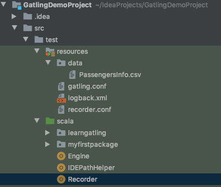
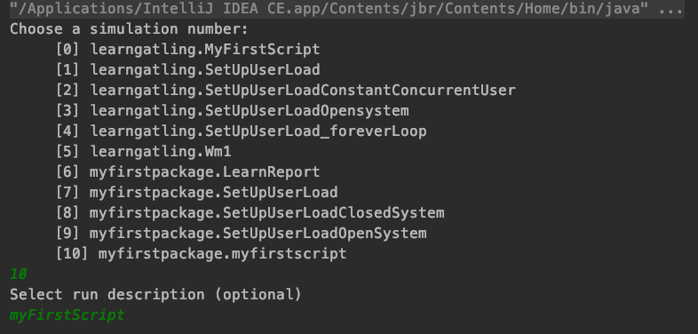
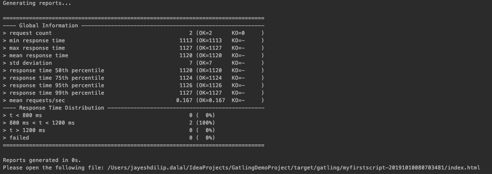
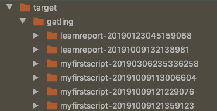
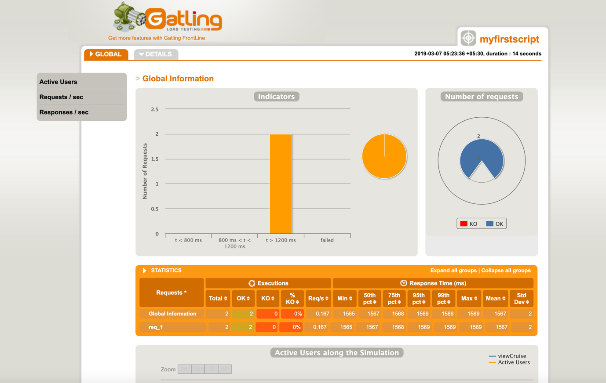

# GatlingProject

## :question: What is this Repository about?
    This is a demo project for running the tests using Gatling using Scala.

## :question: How do I setup this project on my machine?
    - First of all, You will have to install scala plugin in your IDE which is the basic requirement to run this project.
    - Clone this project using the following command: 
        ```
         git clone https://github.com/jayeshd7/GatlingProject.git
        ```
    - Once the cloning is complete, Import the project in your IDE using Import >> Existing Maven Project. It should look like following once your import the project: 

<p align="left">
  <a href="">
    
  </a>
</p>

## :question: How do I run the tests?
    - Right Click on `myfirstpackage\engine` and run using Scala Application.
    - It will ask to choose the simulation number to run.[Simulation Number is actually the test you want to run].
    - After Choosing the Simulation Number, enter the description.(It is optional, you can leave it blank.
<p align="left">
  <a href="">
    
  </a>
</p>

  -  A Screen like the below should be displayed which means your tests are getting executed:
<p align="left">
  <a href="">
    
  </a>
</p>

## Reports
    - Once the test runs are complete, reports would be generated in the target folder:
<p align="left">
  <a href="">
    
  </a>
</p>

- Double Click on `index.html` to view the report in your default browser.
<p align="left">
  <a href="">
    
  </a>
</p>

 - For more details please visit [Gatling][]

 [Gatling]: https://github.com/gatling/gatling
